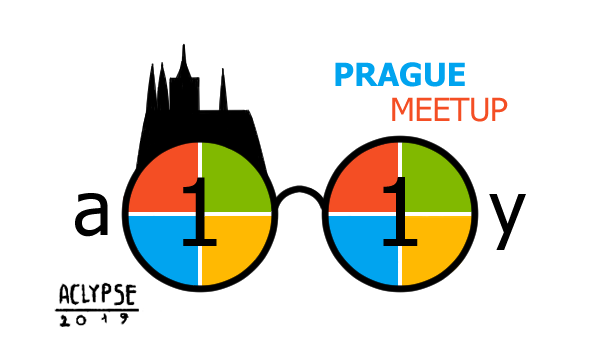
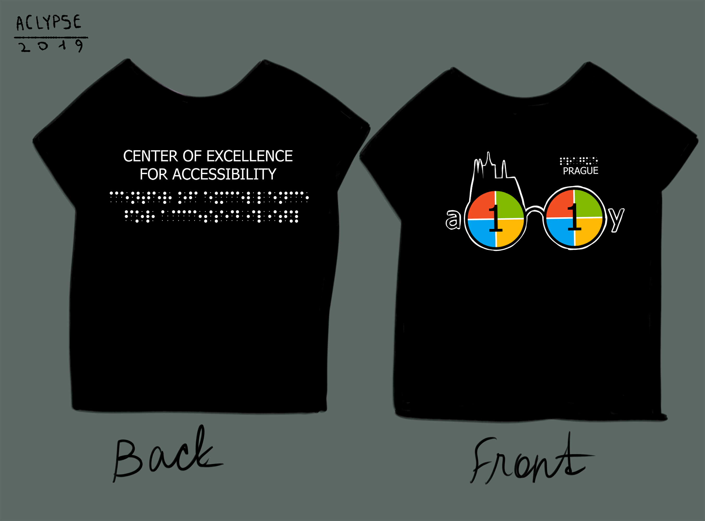

Have you ever heard about the term "accessibility"?

The modern world is becoming aware of disabled people and creates more accessible environment for them. Nowadays you see some new features being integrated into websites, applications and technology that help people with disabilities be able to use it. Browsers provide settings to change fonts and colors, size of the interface, audio-to-speech converter and much more. But the question is, how can a blind person interact with technology without any inconvenience?

This project is all about spreading awareness and helping people with disabilities. The goal is access for all.

## The process

When my father explained to me what accessibility means, this concept struck my head right away. So I laid down some sketches and got approved by my father.

My father tried to come up with the logo himself but he liked my idea more and it seemed more suitable to him.

Then we took those ideas to one of the designers in Microsoft and he taught me a little lecture of the basics of design, composition and main logo features and requirements. After being fired up by their speech I felt more educated and ready to proceed with the design.

The final design was finished in around summer of 2019. Since then it has been used in many places and occasions and few sub logos were created as well.

  

    
  

  

    
  

I would like to continue expanding this project and possibly re-design the logo.

## The design

The final logo shows a pair of glasses which remind us of people with eyesight issues. There are first and last letters of the word "accessibility" on the sides of the glasses. Inside the glasses you see the number of the leftover letters, which symbolizes glasses fixing eyesight. It is a common trick to write long words using only its first and last letter and type the number of leftover letters in between. I used Microsoft colors to resemble the logo's belonging to the company.

Even though this logo is designed for such a large company as Microsoft, I view it a bid like my child because I am the one who designed it.
