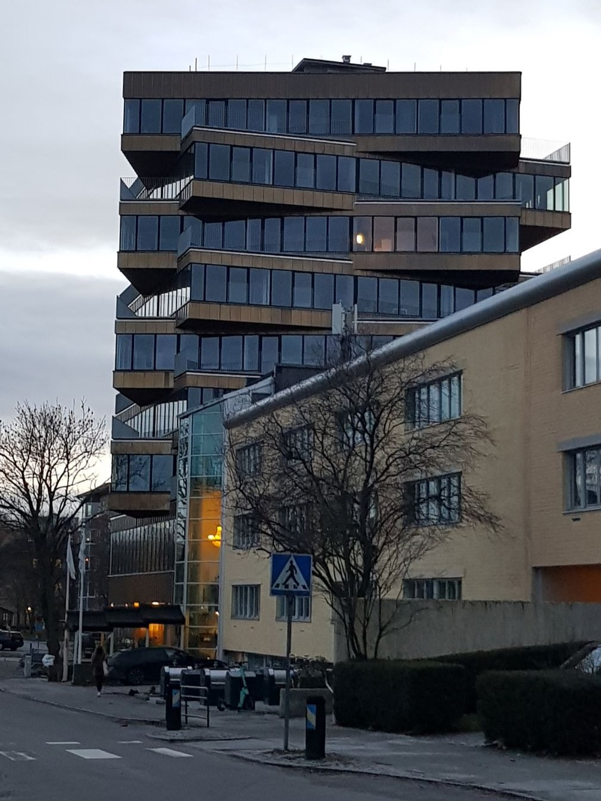

The Erasmus+ project is a program organized mainly for colleges and universities which allows students to experience studying abroad for some time. Our college participates in 3 sub projects: TMDW, READY and CLICK.

**Through Museum Walls to Digital World** is a project about enriching the quality of teaching and learning, integrating technology into education and adapting students to use it in a creative way. This project has six partner schools from six different countries. All the students have an opportunity to visit one of these schools and experience a life out of their home country for a span of one week. For the whole week they have a program arranged in which they visit museums, talk with all the other students and learn about the country's culture.

## The process

There was a task assigned to all the students from our college to create a logos for all three of the Erasmus+ projects.
Nobody properly explained to us the whole point of this project nor the requirements for the logo. Therefore, students didn't really know what to design to fit the aim of the project and all of us were just left to our own fantasy. Even though I didn't have many ideas in mind I started sketching right away to at least come up with something.

  

    
  

  

    
  

I was working on the logo outside of college as well and when I had had all the ideas done in Adobe Illustrator, I sent my teacher the file. I still remember the phrase she told me after she had received the file: "_I just opened it, my jaw fell to the ground and I was drooling over it. What a magical child you are._"

After that she helped me choose the best idea and work on it more properly. I provided her with the final files so she could send them to the organizers of the project.

  

    
  

  

    
  

  

    
  

  

    
  

Then, there had been a long moment of silence. Only in March of 2021 I found out by one of our teachers that my logo has been chosen as the winning one! I literally couldn't believe my ears. My logo being chosen has made a great surprise to me and filled me with hope of fulfilling my goals and dreams of becoming a designer.

And when I had informed my parents about these news, we checked all the information about the project and its contacts. We found out that they've been using this logo since January 2021.

## The design

I imagine museums as fancy and classicist buildings. And the building in this logo represents a museum. But why does it have headphones? Well, aside from being one of the most commonly used pieces of technology, during exhibitions the staff might provide you with headphones to listen to the whole exhibition if you don't speak their language. I thought it was a suitable idea to connect these two objects together, because digital equipment connects you to the walls of museums.

As you can see from the sketches, I had this idea of classicist museum + headphones combination from the start. I'm glad I decided to stay with this concept and the organizers of this project liked it as well.

It was hard to decide on a good color choice. Initially I wanted to use only one color, but the people behind this project wanted the logo to be colorful. I decided to not to go overboard and stick with two colors only, them being purple and orange. Purple represents the digital part as it's a cold color, while orange gives us a welcoming and quite older feeling of museums.

And just a quick side note, I had the opportunity to visit Sweden as part of this program. (Though I don't want to talk about it)

  

    
  

  

    
  

  

    
  

**Erasmus+ website**: http://tmdw-erasmus.eu/ - Through Museum Walls to Digital World
