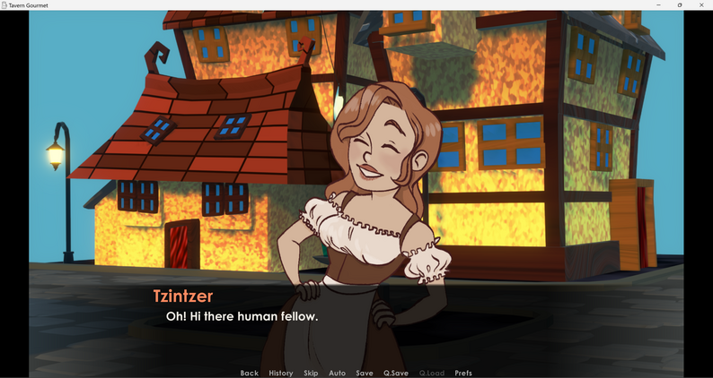

Find yourself in the city of Karminage where all the species live together in peace and harmony.

You meet a cute girl on the street of this city and she hires you as a barman in her newly opened tavern. Help her manage the tavern and listen to the exciting stories of the inhabitants of this city!

> [_Tavern Gourmet_](https://aclypse-ace.itch.io/tavern-gourmet) is a small, humble project. But as the foundational stone in my game development career, it still means the world to me.

The year 2022 marked my most productive year yet. I was constantly creating, learning new tools, and finally started to move forward. By early 2023, I finally decided to create my very first game: [_Tavern Gourmet_](https://aclypse-ace.itch.io/tavern-gourmet).

I chose to make a visual novel because, frankly, it’s the easiest genre out there. I had no experience with game development, and I wanted to create something that would be easy to manage. I also wanted to create something that would allow me to focus on the story and characters rather than the mechanics of the game. And also, it was a great chance to learn the tool I've always wanted to learn: Renp'Py

The main constraint was one week. One week to write a story, come up with characters and, most importantly, learn a new game engine. My first ever game engine at that.

The result was a quirky little game about food, witty yet deep characters, and choices, all set in a medieval tavern—available on [itch.io](https://aclypse-ace.itch.io/tavern-gourmet).

What started as a small experiment became the spark that lit a bigger fire. And after two years, I want to give a small retrospective on how it all came together.

---

## Inspiration

Sometimes, my heart craves old medieval settings. Sometimes I want to fantasize about the future in a cyberpunk reality. Other times, I find myself escaping into the world of fantasy. But during the creation of _Tavern Gourmet_, I was deep in what I like to call my "tavern-core" phase.

There’s just something comforting and rich about medieval taverns and bustling fantasy inns. That warm, chaotic energy inspired the entire tone and setting of the game.

---

## Development Process

Balancing school and game development was **amazing** and turned out to be surprisingly rewarding. I found myself learning brand new skills while still doing what I loved. I opened Visual Studio Code for the first time. Wrote my first lines of code. And learned Ren'Py from scratch.

It wasn’t always smooth sailing, but the excitement of building something on my own kept me going.

The whole gist of visual novels is to come up with an engaging and interesting story, and also to create relatable characters. As for the first visual novel and the first game, I decided to go for something simple and straightforward. But not without adding something deeper into it. Rock guy has a dark background and past. Little boi can be perceived as a canvas for a new fantasy species. And Tzintzer's past, while not fully revealed in the game, has more to it than it might seem.

---

## Visual Style

For the visuals, I went for something simple and stylized. As the main character, Tzintzer ended up with the most sprites, but my personal favorite design was Little boi. There wasn’t much time to make an elaborate GUI—I was learning everything on the go and trying to survive school at the same time. Hence, I decided not to pay attention to it for my first game.

---

## What Went Right / What Went Wrong

**What went right:**

- I learned how to use Ren’Py from scratch
- I managed to complete a full game in one week
- I planted potential seeds for a deeper story
- I proved to myself that I could take on a demanding challenge and finish it

**What could’ve been better:**

- The story is simple and linear
- The choices are straightforward
- Work on GUI
- Polish the art
- Work and polish the backgrounds so they work together with the style of sprites

---

## 📈 Reception & Lessons Learned

Of course, I wasn't expecting huge engagement with the game nor a rating of more than two stars with such a mediocre game, but the positive reviews made my heart race. I received a few kind reviews and even a small donation—and such bits of positive encouragement are what make me thrive and keep going all the time.

### 🔮 Where This Took Me

Since the creation of _Tavern Gourmet_, I’ve participated in two visual novel game jams, one [48-hour physical game jam](https://ondroid91.itch.io/granny-virtual-cookies), and challenged myself to try new ideas. Every new project builds on what I started with _Tavern Gourmet_.

## It has kicked off the journey of trying and refining my skills. Now I can create fully [custom GUI](https://aclypse-ace.itch.io/tick-i-tack) and [animations](https://aclypse-ace.itch.io/home-sweet-unit-404) in Ren'Py. I still look back at this game with fondness—despite its flaws—and I’m genuinely proud of what I managed to create in such a short time.

Watch the creation process of [_Tick-i-Tack_](https://youtu.be/wifXLDdLvhA) for the Ukrainian Micro Visual Novel Jam.

Play my latest NaNoRenO game [_Home, Sweet Unit 404_](https://aclypse-ace.itch.io/home-sweet-unit-404).

And of course, don't forget to give some appreciation to the game that kicked off the establishment of Aclypse, [_Tavern Gourmet_](https://aclypse-ace.itch.io/tavern-gourmet).

# Credits & Specs

- 5 endings
- 20+ minutes of playing time

Main menu background (edited by me) — MChahin on Sketchfab, find the model [here](https://sketchfab.com/3d-models/low-poly-dark-town-c9c64cbc5c774c7dad3c0cc3382c965a)

all songs were downloaded from the next sites:

- [pixabay.com](https://pixabay.com/sound-effects/)
- [freemusicarchive.com](https://freemusicarchive.org/home)

And special thanks to my friends for testing this game!

_made with Ren'Py 7.5.3_
