Tavern Gourmet is the first visual novel (and video game) I have ever made. I have a big passion and deep interest in the game development industry. As any person who is interested in the industry, I've always thought about making my own game.
There was (and still is) a huge crux of the matter: I don't have extensive programming knowledge. So I started searching for some game engines.
I've known about Ren'Py for some time, and one day, I finally decided to give it a try. Visual Novels are almost purely text-based (and visual-based) games, so they are relatively easy to make since you don't have to consider gameplay mechanics, game logic and much more... (unless you are making a hugely complicated VN with multiple endings and thousands of branching paths.)

[Tavern Gourmet](https://aclypse-ace.itch.io/tavern-gourmet) is available to play for **free** on my itch.io. Be sure to check it out, especially if you like wholesome stories with a bit of humor!

    

        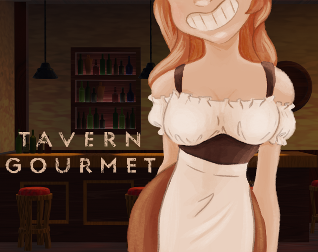
    

## The story

As in any visual novel game, the story is the main aspect and the most engaging part as well.

You find yourself in the city of Karminage where all the species live together in peace and harmony.
You meet a cute girl on one of the streets of this city and she hires you as a barman in her newly opened tavern. Throughout the game you get introduced to a wide range of different customers, each with their own unique story.
It's purely your choice if you want to engage in their stories and help the girl manage her tavern. And who knows, maybe you can find out the mystery that is behind this tavern's establishment?

    

        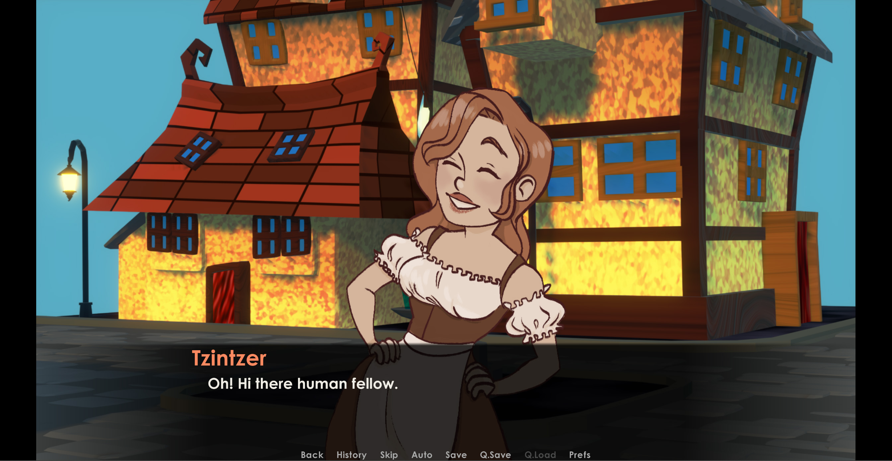
    

    

        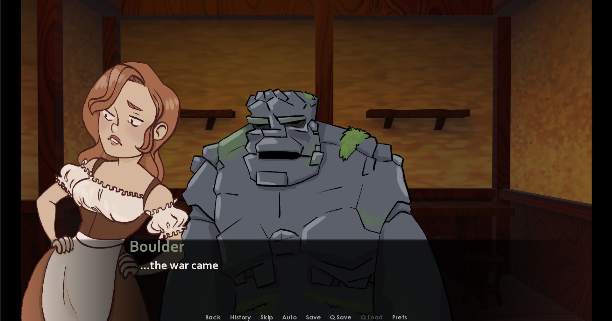
    

    

        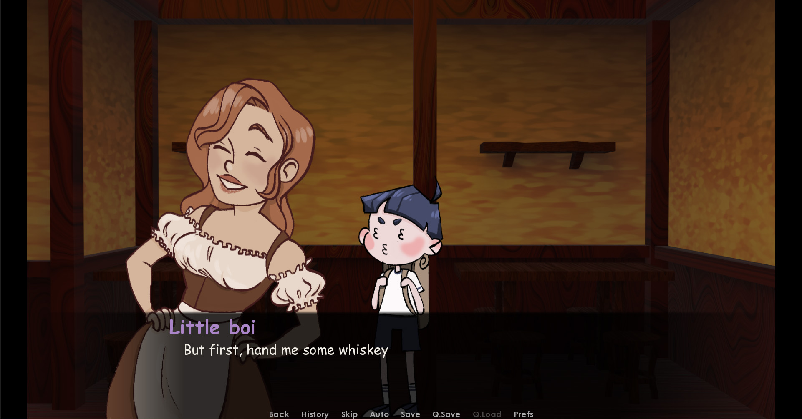
    

## The process

Honestly, it was pretty easy to create this game. But I mean, I didn't even aim to create some outstanding, highly impactful AAA game to be sold all over the world. I just simply wanted to see what I can make with Ren'Py.

Like every story, my project started with the initial idea. The choice was simple: I love the medieval setting, I love unusual characters, and I love red-haired girls. And even though I prefer "story-based" stories over "character-based" ones, I wanted to concentrate on the characters more. So I decided to combine all of this together and... ta-da! The basic idea was born.
Then I created a basic outline of the story. The main character, Tzintzer, was in my head from the start. I had a pretty good vision of how I wanted her to look because I knew I wanted to draw a cute, red-haired and lovable character. And honestly, it was so much fun coming up with her backstory. In the end, I grew to like her a lot. She became almost like my friend and helped me throught the whole process. (Small interesting fact: her name _Tzintzer_ is a Greek word for _ginger_.)

    

        
    

    

        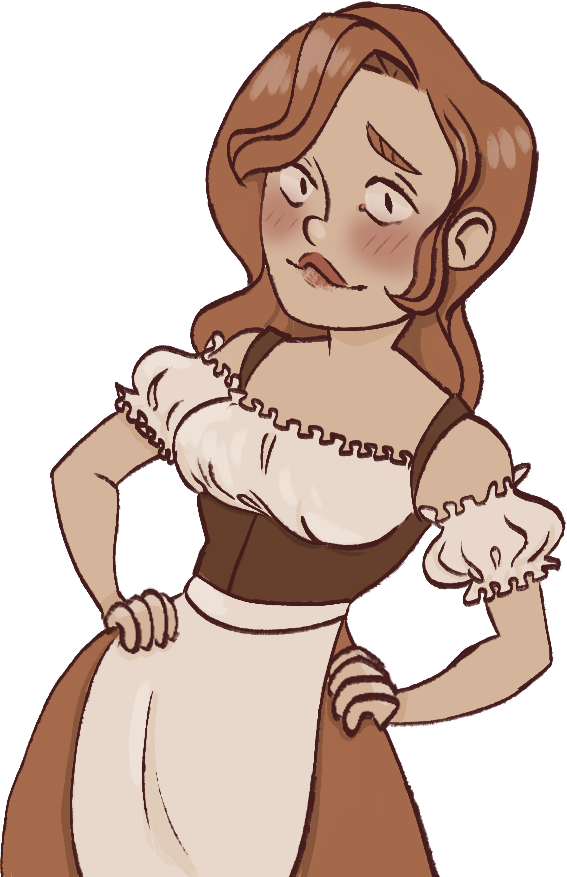
    

    

        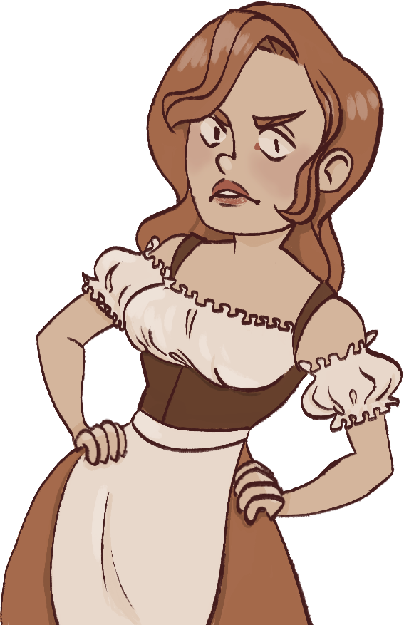
    

Then I had to create other characters. I came up with them relatively fast. The most fun part was drawing them, especially Little boi (I had lots of fun coming up and drawing his expressions).

    

        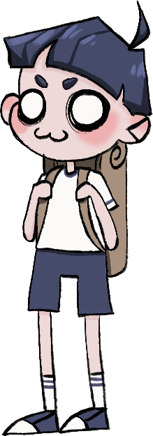
    

    

        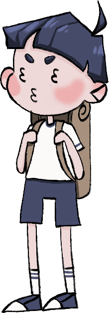
    

    

        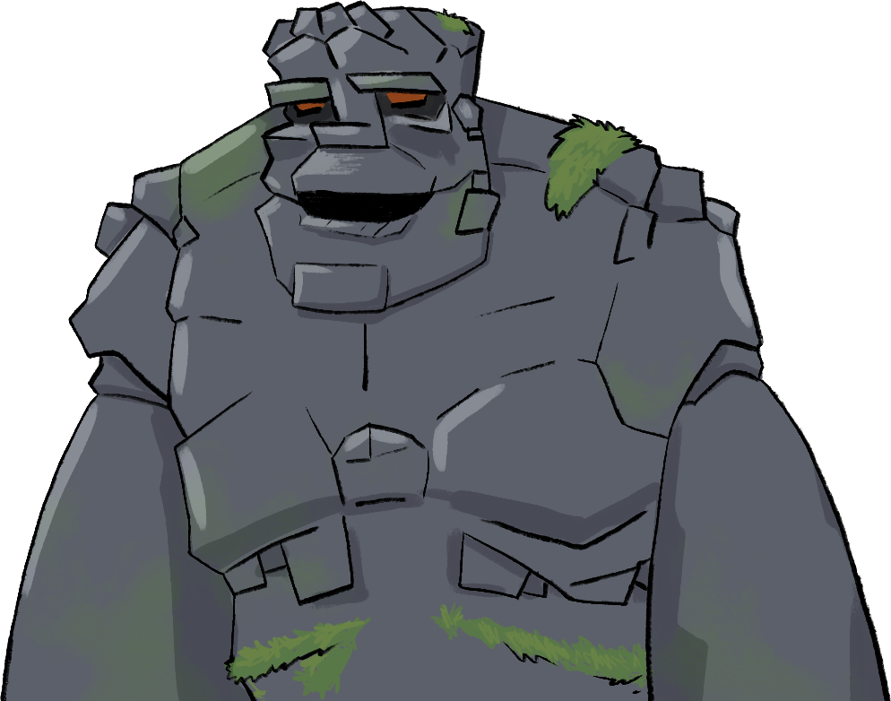
    

    

        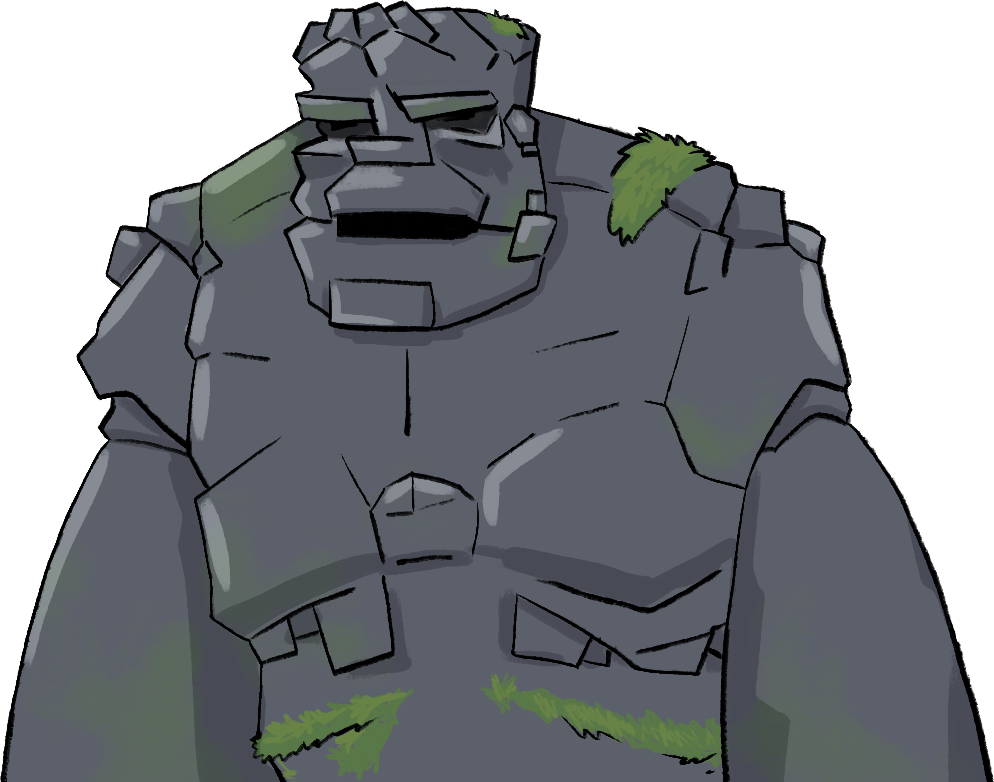
    

Then came the background stage. To give you a little inside fact about me: I've been learning 3D modeling for about a year now, so I decided to use these skills of mine to create a tavern in blender. After all the reference gathering, I came up with something like this:
#/blender tavern renders#/
I still have a lot to learn in 3D, but I'm relatively pleased with the final result. I especially like all the textures of the walls (I mean, just look at them! so yummy!).
{!**texture close-up**}

After all the assets were ready, I started writing the script. Ren'Py language is based on Python (how surprising), and honestly, it was really easy to learn. Especially with all the in-game tutorials and online documentation it provides (thanks Ren'Py Tom for making my life easier). Writing the script didn't present many problems or challenges, though I did stumble upon one problem at the end (otherwise it wouldn't be a real development without any errors, right?). But thanks to Discord, the problem has been solved very quickly, and I didn't have to run through all the thousands of lines of code one by one.

I fell in love with Ren'Py. Not only it's easy to learn, it also provides you so much creativity freedom! For example, there is a possiblity to costumize GUI, but I decided not to play around with it much. Just a simple background retouch, logo design and some font changes were made. I think it's enough for a simple project like this.

After about 2 weeks or so, Tavern Gourmet was ready to be released. All the things that were left to do were some polishing touches and building. Then, I went straight to itch.io and designed the [game's page](https://aclypse-ace.itch.io/tavern-gourmet). Then, I clicked the "done" button and... The game was born into this world!

    

        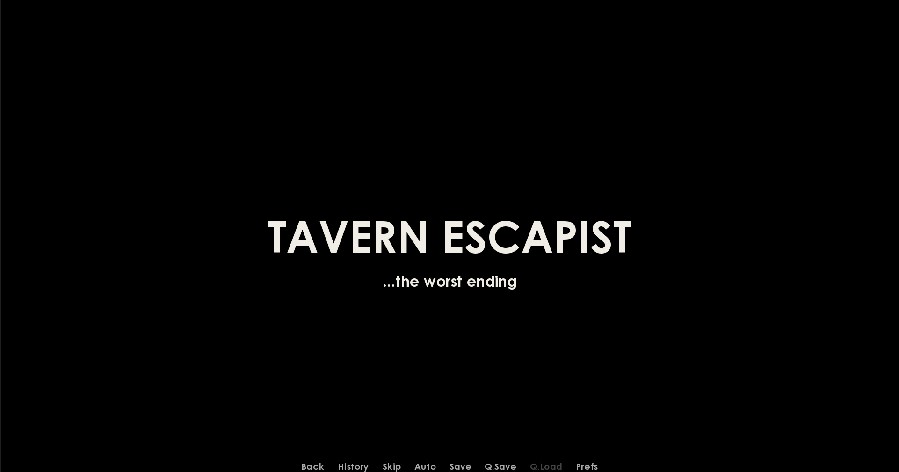
    

    

        <iframe
        scr="https://aclypse-ace.itch.io/tavern-gourmet"
        alt="The game's page on itch.io"
        title="Tavern Gourmet iframe"
        >
    

## Conclusion

Despite all the challenges I faced, I did find myself enjoying the whole process of being an "indie game developer". From coming up with the story idea all the way to the coding and publishing, all stages brought meaningful challenges and excitement along with them to me. Also, my brain is full of many interesting stories which sit in my head and wait patiently until they will be thrown into this world. Visual novels are a great and interactive way to present those stories.
Therefore, I can assure you this isn't my last game project, and you can expect more from me in the future.

Tavern Gourmet is a passion project combining unique characters with an engaging story. If you're looking for a fun way to pass the time, this game is definitely worth checking out. So why not head over to itch.io and give [Tavern Gourmet](https://aclypse-ace.itch.io/tavern-gourmet) a try?

There are 5 endings in total and approximately 20+ minutes of play-time.
All credits, further information and the game itself are listed on the game's [itch.io page](https://aclypse-ace.itch.io/tavern-gourmet).
