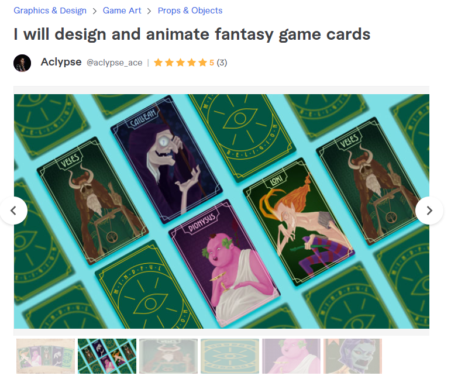
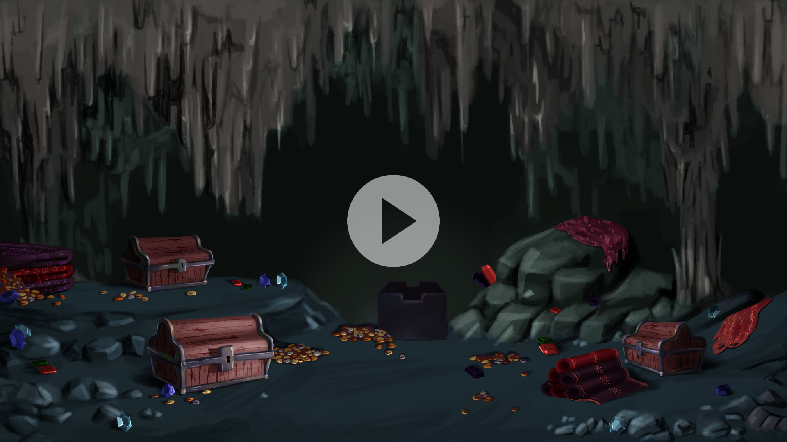
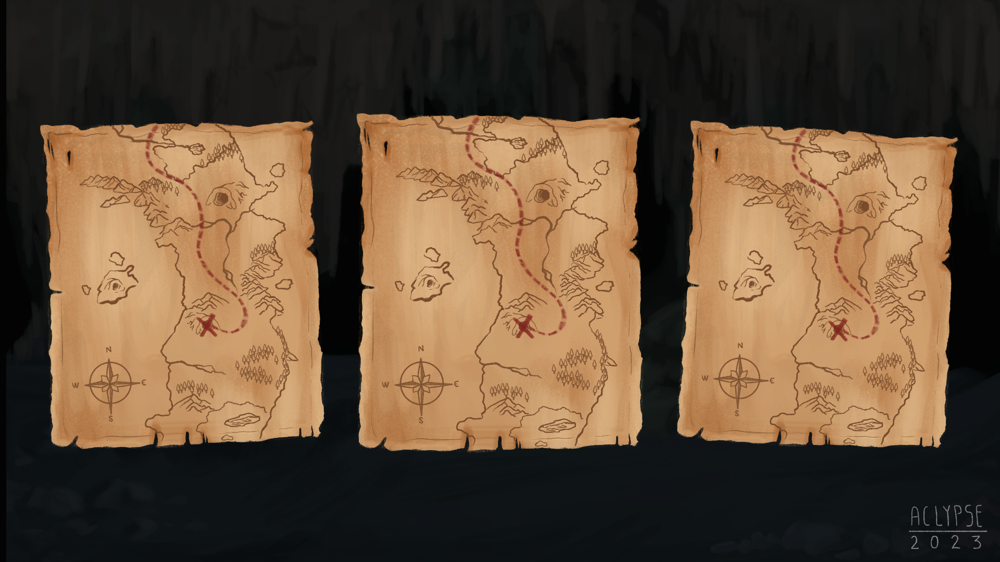
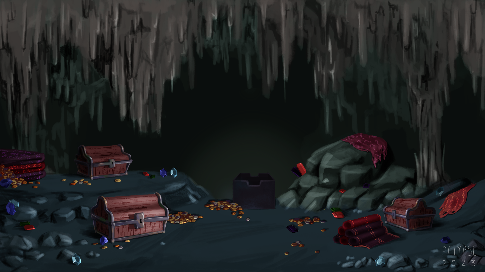
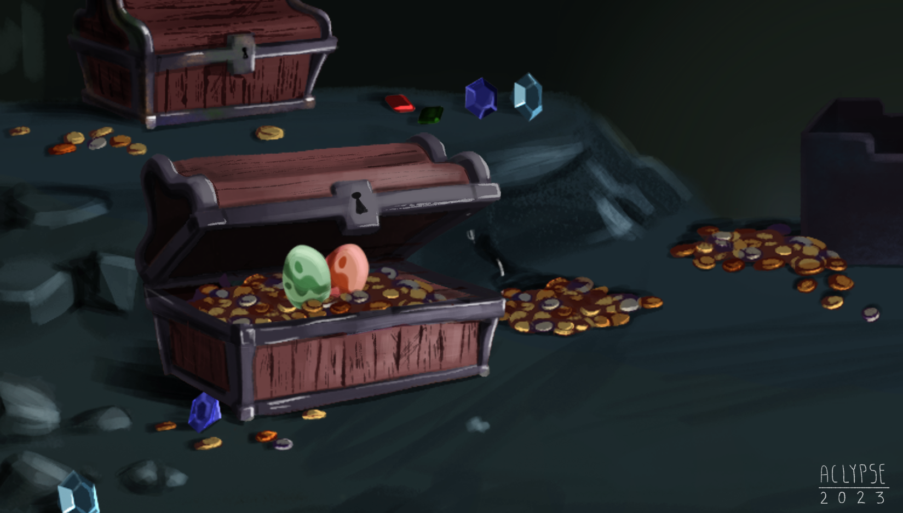

How many of you here enjoy playing games? I believe the vast majority of us have a fondness for them. Personally, I have always liked all types of games ranging from video games of any time to classic board games or those simple games which i used to play with my classmates during school recess.

Speaking of games, it has been quite a while since I began offering my services on Fiverr. One of my most successful gigs involves designing custom cards.

    

        
    

Recently, I received a no ordinary order request from a client named Archer Horner.
You see, my gig offers up to five fantasy cards, which can be animated. However, Archer had a different requirement. He wanted a full 30-second animation instead of individual cards. Initially, I was hesitant to accept the order as it didn't align with the services I provide in my gig. But as soon as Archer described his project to me, I couldn't help but fall in love with it and accept his order.

    

        
    

[Archer's project](https://www.topdeckgames.org/) is a "board game enhancement box filled with treasures from the Lair of an Elder Dragon." Considering my love for games (and my recent immersion in The Inheritance series), his order came "at the right time”.

## The process

The work process with Archer was incredibly smooth and stress-free. We quickly found and established a shared language and clear understanding. He provided me with detailed descriptions of his requirements, which always fascinated me. Each time I presented him with my progress, he pointed out the parts he liked and the parts which he wanted me to change. His approach was remarkably positive and friendly, never once putting pressure on me despite the short dead-line. but it’s how game industry works. i like how Archer put it: _“This was no ordinary request for what I was looking for. I had a tall order and a short budget on time. This artist created some of the most fascinating and beautiful work I've received, even among high-caliber artists I've worked with. Being a prolific and talented artist is one thing, but in the business world sometimes projects have tight deadlines.”_

    

        
    

    

        
    

    

        
    

## The animation

To be added (i hope).

## Conclusion

I am incredibly grateful for the opportunity to work on this project and renew my motion graphics skills. I cannot express enough appreciation to Archer for his kind words, his collaborative approach, and the chance he gave me to take part in his project.
I sincerely encourage all board game enthusiasts, particularly those who enjoy games like Ticket to Ride, Splendor, Carcassonne, and others, to visit the [project's website](https://www.topdeckgames.org/) and [facebook group](https://www.facebook.com/groups/177686871875435) and follow it on its journey. Although it is still in development, their Kickstarter page will launch in August 2023!
