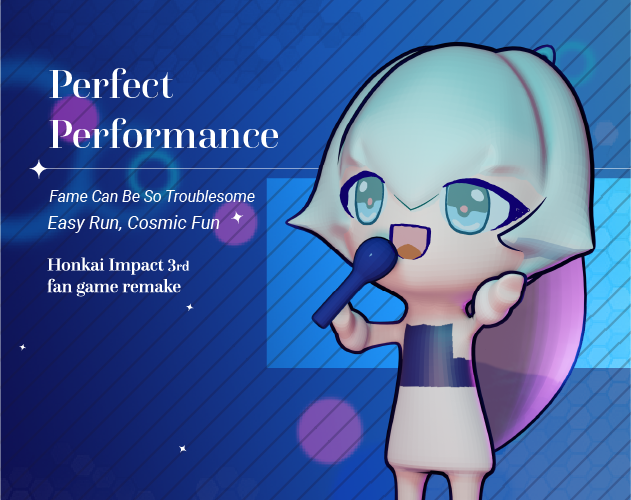
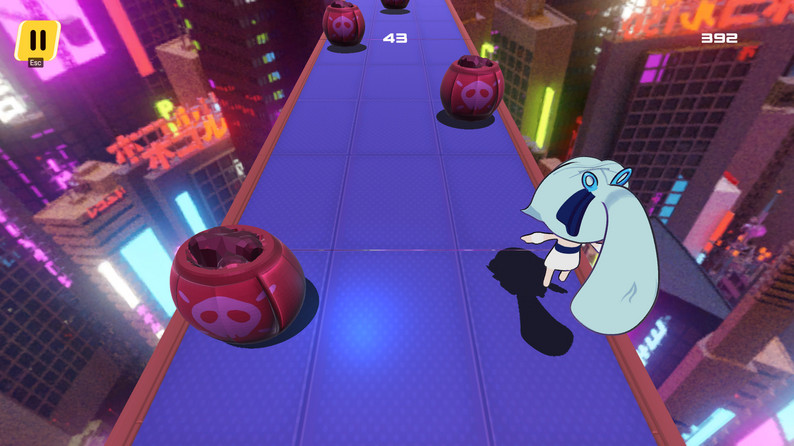
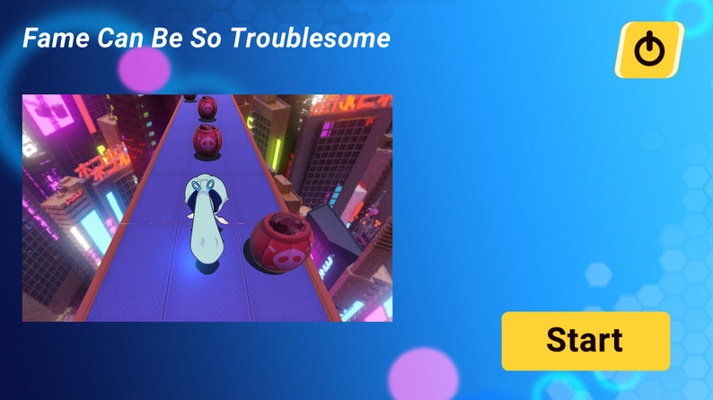
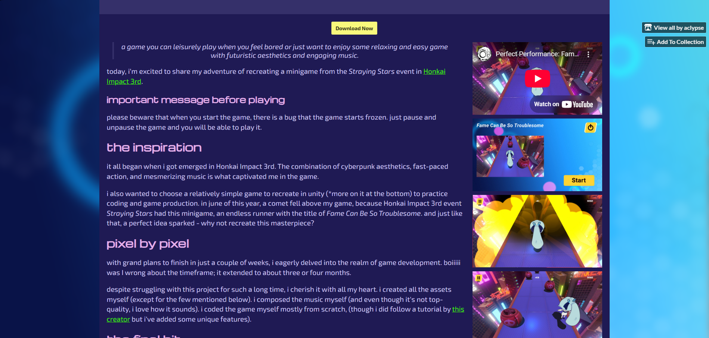
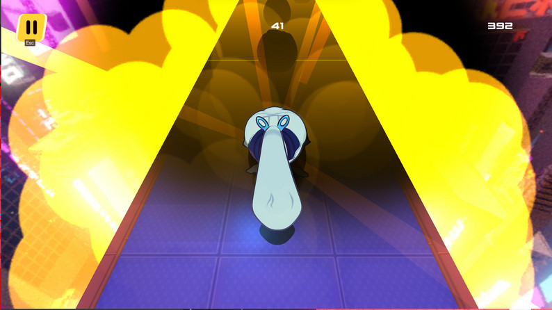

The hype around _Genshin Impact_ isn’t what it used to be. But one game that deserves far more attention hasn’t received nearly enough of it: the very first title from HoYoverse—the one that started it all—[_Honkai Impact 3rd_](https://honkaiimpact3.hoyoverse.com/global/en-us/fab).

> It was June 29th when I updated _Honkai Impact_ to the latest version—filled with fresh content, new characters, and a new event [_Straying Stars_](https://www.hoyolab.com/article/19557574). I didn’t expect much from its minigames, but soon, I found myself playing the [endless runner minigame](https://aclypse-ace.itch.io/fame-can-be-so-troublesome) on repeat. Something about its simplicity and charm pulled me in. That same week, I finally felt determined enough to start my game development journey for real, not just simple [visual novel games](https://aclypse.me/project/tavern-gourmet).

Every tutorial I’d ever seen said the same thing: “start by building small projects” and "start with easy projects with familiar mechanics". And after the endless runner minigame I finally had a perfect reference to follow. So, the decision came instantly: I was going to make a copy of that _Honkai Impact_ endless runner minigame called [_Perfect Performance: Fame Can Be So Troublesome_](https://youtu.be/P16fBPdLExQ?si=KdHyvqEoIZ4JvL3E&t=86). I mean, endless runners are easy to code, right? Right?

## Development Process

---

I gave myself a challenge—to dedicate an entire week to development and complete it in **one week.** (remember this part for later)

At that point, my game dev experience consisted of two Unity tutorials and one [Ren’Py game](https://aclypse-ace.itch.io/tavern-gourmet). I used what little knowledge I had and tried to build something similar to _Flappy Bird_ mechanics: the player [stays in place while obstacles rush toward them](https://youtu.be/XtQMytORBmM?si=yJjqQGRjmAQrS_Wh&t=970).

Then came the first error. And it prevented me from moving on.

_“Don’t watch a tutorial, don’t watch a tutorial…”_ I kept repeating to myself, trying to avoid falling into tutorial hell. At first, I held strong.

But eventually, I gave in. I spent most of my time Googling code snippets, following tutorials, and asking friendly Discord people for help.

## The Darkest Point

---

The biggest disappointment hit after the [Unity pricing scandal](https://mancunion.com/2023/10/19/a-timeline-of-the-unity-controversy/), and when I realized that indie games from unknown developers are often flagged as a potential threat to your computer. Ouch.

By that time, I already had a finished MVP. A completed and playable game for people to enjoy. I had poured so much effort and time into it, only to be dismissed because of security reasons. That was the darkest moment and I felt at my lowest.

I talk more about it in the Itch.io post ["...and Unity is dead"](https://aclypse-ace.itch.io/fame-can-be-so-troublesome), so I won’t repeat myself here.

## Visuals

---

I copied most of the visuals from the original _Honkai Impact_ minigame:

- Used Shigure Kira as the main character
- Recreated the same running platform textures
- Made identical crates

Some aspects were changed, however the style stayed recognizable and true to its original source.

All assets were made in Blender, and textures were hand-drawn in Photoshop.

## UI & VFX

---

Not much surprise here—I copied the UI from the original minigame as well. My UI is simple and still a bit lacking, but I like the overall aesthetic, especially when paired with the game’s Itch.io page.

I also experimented with Unity’s particle system. The explosion effect I made with help from a [tutorial](https://youtu.be/lw4T8gfcKZ0?si=S4Ol2UTd9iRvjh4K) turned out really well as I remember being glued to watching the effect over and over again.

## Music

---

This part? My favorite.

I don’t have much experience with music. Sure, I casually play piano and sing from time to time, but I wouldn’t call myself even a beginner musician.

I tried every music studio out there: FL Studio, Reaper, Waveform... I wanted to stick with FL Studio since it’s the same tool used for my [favorite game’s](https://undertale.com) music and very intuitive to work with, but I couldn’t justify the price.

But then I found [LMMS](https://lmms.io). It’s free, similar to FL Studio, and honestly became my lifesaver.

Late at night, every night, I worked on the music and melody. I started by trying to mimic the soundtrack from _Fame Can Be So Troublesome_, but eventually created something original. In the end, I loved the soundtrack so much that it became my favorite part of the game—especially the underwater-like effect that plays when the game is paused.

I still listen to that track on repeat. That’s how much I like it.

## What Went Right / What Went Wrong

---

If you remember, I asked you to remember the part about one week deadline. Now the Chekhov's gun with shoot. During the development process, I had big plans—multiple levels, characters, coins, power-ups. But I eventually decided to stick with a simple MVP, because the whole development process extended from one week to two months.

**What went right:**

- I created a full MVP game from scratch
- I got hands-on experience with Unity
- I learned the basics of music production
- I pushed myself to learn practically

**What went wrong:**

- Extremely poor time estimation (one week turned into two months)
- Over-ambitious initial scope
- Struggled to avoid tutorials when needed
- Unity scandal
- Game flagged as a possible threat by Windows

## What I’d Do Differently Now

---

I’m not going to lie, I was a bit disappointed with the final result. I had high expectations for my first game, and while it’s playable, it’s not what I envisioned. I wanted to create something that would be fun and engaging, but I ended up with a simple endless runner. However, I still perceive it as my first learning experience, and every starting point is a valuable achievement in one's life.

However, here is just a small list of things I would do differently:

- Plan the scope better from the start
- Start small and gradually add features
- Focus on one mechanic at a time
- Don’t stress about tutorials—embrace learning

## Reception & Lessons Learned

---

It’s playable. It has a clean visual style and a killer soundtrack. More importantly, it gave me valuable experience in the full game development process.

I made all my friends (and even my teacher) play the game (just so they could compliment me on it). And these are the only people I could get feedback from.

## Where This Took Me

---

Since _Fame Can Be So Troublesome_, I haven’t made much progress as this project left a little unpleasant memories.

But even one youtuber said a valuable advice*: "Make small games focused on mechanics you want to use in your dream game and post them online. "* That’s the mindset I want to take into my next big project: [_Inkwell Institute_](https://aclypse-ace.itch.io/inkwell-institute). Stay tuned for devlogs!

I'd also like to add a few final words:

> Don’t worry if you rely on tutorials as a beginner. Everyone learns differently. All programmers Google stuff. Seriously—every. single. one. Don’t be afraid to do the same. Why do best practices and design patterns exist? So we can Google them.

And yes, [_Perfect Performance: Fame Can Be So Troublesome_](https://aclypse-ace.itch.io/fame-can-be-so-troublesome) is known by everyone as "the one that was supposed to take one week to finish… but took two months instead." However, I still hold it dear to my heart as a valuable learning experience which gave me the most important thing: a starting point.

Don't hesitate to check out the game on [Itch.io](https://aclypse-ace.itch.io/fame-can-be-so-troublesome) and watch me grow as an aspiring game developer!
